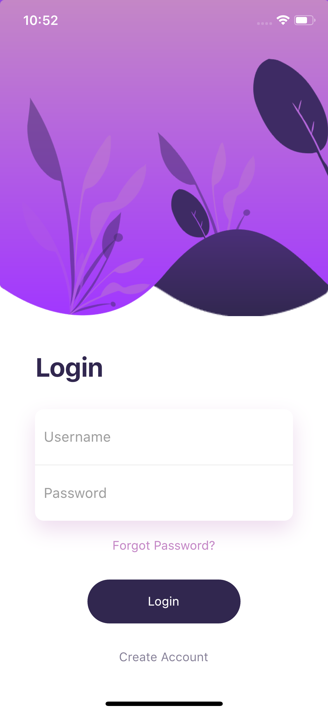

## Flutter Beautiful Login Page UI Design and Animation - Day 13

# Login_UI Version 2

Ce projet Flutter est une interface utilisateur de connexion avec des animations de glissement vertical pour améliorer l'expérience utilisateur.

### [Watch it on Youtube](https://youtu.be/FTz6TVcdh7Y)

## Comment Exécuter le Projet

1. Clonez le dépôt : `git clone https://github.com/VIA2NEY/day_13_login_page_2.git`
2. Naviguez dans le répertoire : `cd day_13_login_page_2`
3. Installez les dépendances : `flutter pub get`
4. Exécutez l'application : `flutter run`

## Fonctionnalités

- **Animation de Glissement** : Les éléments de la page de connexion apparaissent avec une animation de glissement vertical.
- **Responsive** : L'interface est conçue pour s'adapter à différentes tailles d'écran.
- **Design Moderne** : Utilisation de couleurs et d'ombres pour un design visuellement attrayant.

## Captures d'Écran

## Technologies Utilisées

- **Flutter**: Framework pour la création d'applications mobiles multiplateformes.
- **Dart**: Langage de programmation utilisé par Flutter.
- **simple_animations**: Package utilisé pour les animations.

## Structure du Projet

**lib/**: Contient le code source de l'application.

- **main.dart**: Point d'entrée principal de l'application.
- **home_page.dart**: Contient la structure et la logique de la page de connexion.
- **animation/**:
  - **fade_animation.dart**: Définit une animation de glissement utilisée dans l'interface utilisateur.

## Description des Fichiers

1.1 main.dart

- **main.dart** : Ce fichier est le point d'entrée principal de l'application. Il initialise l'application Flutter et définit le thème de base. Il spécifie également le widget principal qui sera affiché, qui dans ce cas est `HomePage`.

1.2 home_page.dart

- **home_page.dart** : Ce fichier contient la structure de la page de connexion de l'application. Voici une explication des différentes parties :

    - **HomePage** : C'est un widget stateful qui représente la page de connexion.
        - **Scaffold** : Le widget principal qui fournit la structure de base visuelle de la page.
        - **SingleChildScrollView** : Permet le défilement lorsque le contenu dépasse la taille de l'écran.
        - **Column** : Dispose les éléments verticalement et les aligne à gauche.
        - **Stack** : Permet de superposer plusieurs widgets les uns sur les autres.
            - **Positioned** : Positionne les widgets à des emplacements spécifiques dans la pile.
            - **FadeAnimation** : Applique une animation de glissement vertical aux widgets enfants. Utilisé pour les images de fond et le texte.
        - **Padding** : Ajoute un espacement autour des éléments de la colonne principale.
        - **TextField** : Champs de saisie pour le nom d'utilisateur et le mot de passe.
        - **TextButton** : Bouton pour les actions "Forgot Password?" et "Create Account".
        - **MaterialButton** : Bouton de connexion avec un style arrondi et une couleur de fond personnalisée.

1.3 fade_animation.dart

- **fade_animation.dart** : Ce fichier définit une animation de glissement vertical. Voici une explication de la classe principale :

    - **FadeAnimation** : C'est un widget stateless qui applique une animation de glissement vertical à son enfant.
        - **delay** : Délai avant le début de l'animation.
        - **child** : Widget enfant qui reçoit l'animation.
        - **PlayAnimationBuilder** : Utilisé pour créer une animation basée sur une translation verticale. Gère la transition de la position verticale du widget enfant.

